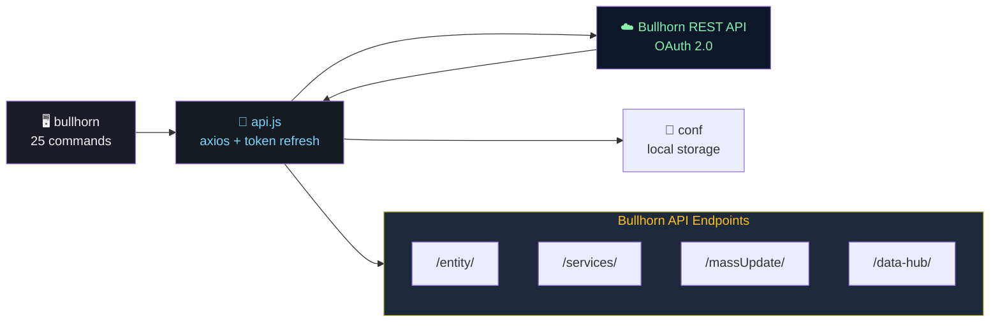

# bullhorn-cli

<div align="center">

```text
 ___.         .__  .__  .__                                         .__  .__ 
 \_ |__  __ __|  | |  | |  |__   ___________  ____             ____ |  | |__|
  | __ \|  |  \  | |  | |  |  \ /  _ \_  __ \/    \   ______ _/ ___\|  | |  |
  | \_\ \  |  /  |_|  |_|   Y  (  <_> )  | \/   |  \ /_____/ \  \___|  |_|  |
  |___  /____/|____/____/___|  /\____/|__|  |___|  /          \___  >____/__|
      \/                     \/                  \/               \/         
```

<!-- Badges -->

[](https://www.npmjs.com/package/bh-cli)
[](https://nodejs.org/)
[](LICENSE)
[](#command-cheat-sheet)
[](#api-coverage)

### At a Glance

| 📥 Get | 🔍 Search | ✏️ Create | ✂️ Update | 🗑 Delete |
|---|---|---|---|---|
| `bullhorn get JobOrder 123` | `search -q "isOpen:1"` | `create Candidate ...` | `update 456 email="..."` | `delete Note 789 --force` |

| 🔐 Auth | 📁 Files | 📋 Resumes | ⚙️ Services | 🧾 Pay & Bill |
|---|---|---|---|---|
| `auth login` | `file upload` | `resume parse` | `service dd` | `pay-bill timesheet` |

</div>

---

## Installation

```bash
git clone https://github.com/lham/bh-cli.git && cd bh-cli
npm install && npm link          # makes `bullhorn` (or `bh`) available globally
```

---

## Quick Start

```bash
# 1. Authenticate (interactive — enter your Bullhorn credentials)
bullhorn auth login

# 2. Search for candidates
bullhorn search Candidate -q "isDeleted:0 AND name:John*" -c 20

# 3. Get a single record with to-many associations
bullhorn get Candidate 12345 primarySkills -c 10 --sort="-dateAdded"

# 4. Switch to JSON output
bullhorn get Candidate 123 -o json
```

That's it. You're talking to the Bullhorn REST API from your terminal — full speed, zero boilerplate.

---

## Terminal Demo

```
$ bullhorn auth login
  🔐 Bullhorn Authentication
   
  Username:       lham@company.com
  Password:       ••••••••
  Client ID:      abc123xyz
  Client Secret:  ••••••••
   
  ✅ Session active — token refreshed automatically

$ bullhorn get Candidate 12345 primarySkills -c 5
  ⠋ Fetching Primary Skills...

  ┌─────┬─────────────────────────┬──────────┐
  │ Id  │ Name                    │ Active   │
  ├─────┼─────────────────────────┼──────────┤
  │ 964 │ JavaScript              │ true     │
  │ 684 │ React                   │ true     │
  │ 253 │ Node.js                 │ true     │
  │ 412 │ TypeScript              │ true     │
  │ 578 │ Docker                  │ true     │
  └─────┴─────────────────────────┴──────────┘

$ bullhorn search JobOrder -q "isOpen:1" --fields=id,title,dateAdded -s "-dateAdded" -c 10
  ⠋ Searching JobOrders...

  ┌──────┬─────────────────────────────────┬──────────────┐
  │ Id   │ Title                           │ Date Added   │
  ├──────┼─────────────────────────────────┼──────────────┤
  │ 7891 │ Senior Backend Engineer          │ 2026-09-25   │
  │ 7884 │ Full-Stack TypeScript Dev        │ 2026-09-23   │
  │ 7870 │ DevOps Platform Lead             │ 2026-09-20   │
  └──────┴─────────────────────────────────┴──────────────┘

$ bullhorn create Candidate firstName="Jane" lastName="Doe" email="jane@acme.com" owner.id=100
  ⠋ Creating Candidate...

  ✅ Created — Id: 45678
```

---

## Architecture



---

## API Coverage

| Area | Status | Commands |
|---|:---:|---|
| Authentication (OAuth 2.0) | ✅ | `auth login/logout/status` |
| Token Refresh (auto) | ✅ | axios interceptor |
| Entity CRUD | ✅ | `get`, `create`, `update`, `delete` |
| Search (Lucene) | ✅ | `search` |
| Query (JPQL) | ✅ | `query` |
| Entity Metadata | ✅ | `meta` |
| Entity Flowchart | ✅ | `entities` |
| To-many Fetch | ✅ | `get [toManyFieldName]` |
| Association / Entitlements | ✅ | `associate`, `disassociate`, `association`, `entitlements` |
| Soft Delete | ✅ | `soft-delete` |
| Department / My Entities | ✅ | `department`, `my` |
| All Corp Notes | ✅ | `all-corp-notes` |
| Login Info (diagnostics) | ✅ | `login-info` |
| File Operations | ✅ | `file (get/upload/attach/detach)` |
| Resume Operations | ✅ | `resume (upload/download/parse)` |
| Business Services (13 subcmds) | ✅ | `service *` |
| Effective-Dated Entities | ✅ | `version (list/create/update/delete)` |
| Data Hub | ✅ | `data-hub (upsert/get/source-system/entity-type/schema-version)` |
| Bulk Update | ✅ | `bulk-update` |
| Pay & Bill / Timesheet | ✅ | `pay-bill` — **104 entities** |
| Help / Entity Reference | ✅ | `help --entities` (203 types) |

---

## Command Cheat Sheet

Full per-command usage with options — see `bullhorn --help` for live help, or run `bullhorn <command> --help`.

### Core CRUD & Query

| Command | One-liner |
|---|---|
| `bullhorn auth login` | Interactive login → saves session token locally |
| `bullhorn get <entity> <id> [toMany]` | Single entity + optional to-many association |
| `bullhorn search <entity> -q <lucene>` | Lucene text search |
| `bullhorn query <entity> -w "<sql>"` | SQL-like JPQL query |
| `bullhorn create <entity> k=v...` | Create with key=value pairs |
| `bullhorn update <entity> <id> k=v...` | Update by ID |
| `bullhorn delete <entity> <id> --force` | Hard delete (confirmation required by default) |
| `bullhorn soft-delete <entity> <id>` | Soft delete (isDeleted=true) |

### Query Enhancements (shared flags)

| Flag | Applies To |
|---|---|
| `-f, --fields` | get, search, query |
| `-c, --count` / `--start` | pagination |
| `-s, --sort` / `--orderBy` | sort order (prefix `-` or use `DESC`) |
| `-o, --output table\|json` | output format (table default) |
| `--effectiveOn YYYY-MM-DD` | effective-dated entities |
| `--layout name` | layout view (e.g. "CandidateSummary") |
| `--show-editable` / `--show-read-only` | field permissions |
| `--privateLabelId id` | private label filtering |
| `--meta off\|basic\|full` | response metadata |
| `--jsonp name` | JSONP callback |

### Advanced Operations

| Command | One-liner |
|---|---|
| `bullhorn associate <entity> <id> <assocField> <ids...>` | Create to-many associations |
| `bullhorn disassociate <entity> <id> <assocField> <ids...>` | Remove to-many associations |
| `bullhorn association <entity> <assocField> --ids <ids>` | Bulk association lookup |
| `bullhorn entitlements <entity>` | Check permissions |
| `bullhorn department <type> --departmentIds ids` | Department-scoped queries |
| `bullhorn my <type>` | User-owned entities |
| `bullhorn all-corp-notes --clientCorpId id` | All notes across a corporation |
| `bullhorn login-info <username>` | Resolve data center (no auth needed) |
| `bullhorn entities` | Entity relationship flowchart |
| `bullhorn meta <entity>` | Field metadata & types |

### File & Resume Ops

| Command | One-liner |
|---|---|
| `bullhorn file get <entity> <id>` | List or download attachments |
| `bullhorn file upload <entity> <id> --file path` | Upload a file |
| `bullhorn file attach/detach <entity> <id> <fileId>` | Attach / remove file |
| `bullhorn resume upload <entity> <id>` | Upload a resume |
| `bullhorn resume download <entity> <id>` | Download a resume (base64) |
| `bullhorn resume parse-to-candidate --file path` | Parse → Candidate / Education / Skills |
| `bullhorn resume parse-to-hrxml/html/text` | Parse → structured formats |

### Business Services (13 subcommands)

| Command Group | One-liner |
|---|---|
| `service direct-deposit` | Candidate bank account management |
| `service corporate-user` | CRUD corporate users |
| `service corporate-user-delegation` | User delegations (set/remove) |
| `service placement-change-request` | Placement change requests |
| `service billable-charge` | Billable charge CRUD |
| `service customer-required-field-meta` | Custom required field definitions |
| `service placement-customer-required-field` | Placement-specific CRFs |
| `service job-customer-required-field` | Job-specific CRFs |
| `service placement-crf-config` | Placement CRF configuration |
| `service job-crf-config` | Job CRF configuration |
| `service events` | Event subscriptions (subscribe/list/consume/unsubscribe) |
| `service call <name>` | Generic `/services/{name}` endpoint |

### Effective-Dated & Pay & Bill

| Command | One-liner |
|---|---|
| `version list <entity> <id>` | List all version records |
| `version create <entity> k=v...` | Create new effective-dated version |
| `version update <entity> <id> --versionId vid` | Update specific version |
| `version delete <entity> <id> --versionId vid` | Delete version (soft-deletes root) |
| `data-hub upsert` | Bulk upsert up to 100 records |
| `data-hub get/source-system/entity-type/schema-version` | Data Hub management |
| `bulk-update <entity> --ids ids k=v...` | Mass update multiple records |
| `pay-bill <entity> [id]` | **104 Pay & Bill entities** (timesheets, invoicing, payroll, etc.) |

### Help

| Command | One-liner |
|---|---|
| `bullhorn help` | All available commands |
| `bullhorn help --entities` | 203 supported Bullhorn entity types |
| `bullhorn help <Entity>` | Entity-specific metadata + recommended commands |

---

## Configuration

Sessions persist locally via [`conf`](https://github.com/sindresorhus/conf):

| Platform | Config Path |
|---|---|
| Linux | `~/.config/bh-cli/config.json` |
| macOS | `~/Library/Preferences/bh-cli/config.json` |
| Windows | `%APPDATA%\bh-cli\config.json` |

Stored values: `BhRestToken`, `restUrl`, `refreshToken`. **Treat as sensitive.**

Pre-fill login prompts with environment variables:

```bash
export BH_USER_NAME="your_username"
export BH_USER_PASSWORD="your_password"
export BH_API_CLIENT_ID="your_client_id"
export BH_API_CLIENT_SECRET="your_client_secret"
```

---

## License

MIT — [Lawrence Ham](mailto:lham@rcpsolutions.net)
